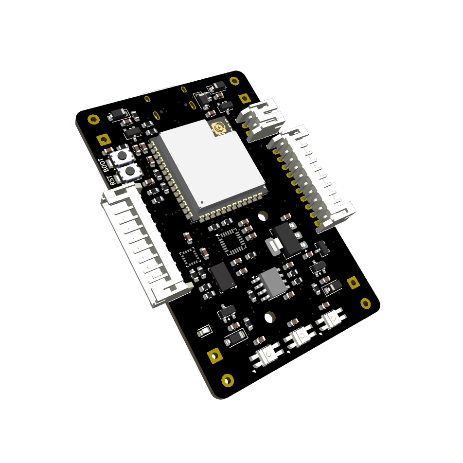
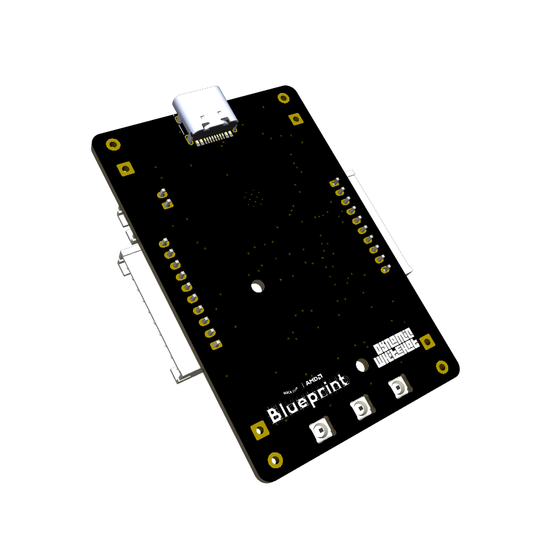
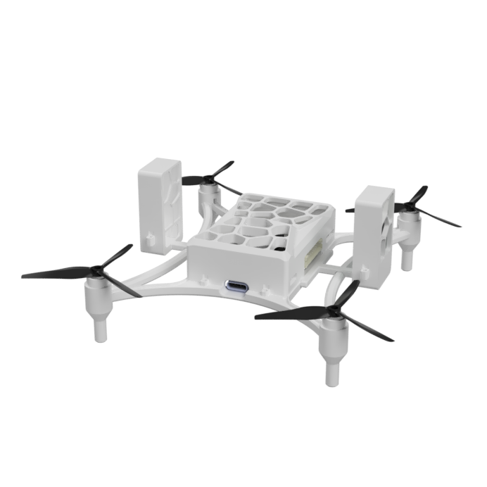

# Orbit
## An ESP32-powered mini drone with autonomous following capability

## Features:
- ESP32 S3 Wroom 1u SoM
- 4x 0716 coreless motors
- MPU6050 for gyro
- QMC5883 compass
- MS5611 pressure sensor for altitude hold
- 3x SK6812 for signal LEDs
- Battery charging via USB-C
- 2x frame mounted DWM1000 for position tracking
- 1x small form factor DWM1000 board "beacon"

## Why I designed this project:
I wanted to design a drone for HackClub's Blueprint program, but not just any regular drone. I wanted to add a feature that would make it stand out, something that would make it unique. So, I decided to give it the ability to autonomously follow you to an accurate degree. After doing some research, I found the DWM1000 modules and decided to design this project. I designed and redesigned the PCBs and CAD for this project many times, with each iteration improving upon the last. This project also gave me the ability to test and improve my PCB and CAD design skills. I understood a lot more about schematic connections while working on this project and learned to route much cleaner traces, even on a compact board.

## Image gallery:
<table align="center">
  <tr>
    <td align="center">
      
    </td>
    <td align="center">
      
    </td>
  </tr>
  <tr>
    <td align="center" colspan="2">
      
    </td>
  </tr>
</table>

## Schematics And PCBS

Drone Control Board

<table align="center">
  <tr>
    <td align="center" colspan="2">
      
    </td>
  </tr>
  <tr>
     <td align="center">
      
    </td>
    <td align="center">
      
    </td>
  </tr>
</table>

Beacon Board

<table align="center">
  <tr>
    <td align="center" colspan="2">
      
    </td>
  </tr>
  <tr>
     <td align="center">
      
    </td>
    <td align="center">
     
    </td>
  </tr>
</table>

UWB Module Board

<table align="center">
  <tr>
    <td align="center" colspan="2">
      
  </tr>
  <tr>
     <td align="center">
      
    </td>
    <td align="center">
      
    </td>
  </tr>
</table>

## How It Works

The drone is powered by a custom designed PCB based on the ESP-32 S3 Wroom 1u SoM. It includes three SK6812 mini-e LEDs to serve as a status signal, located at the rear of the drone. There are three sensors located on board to help with flight. The MPU-6050 is a triple-axis accelerometer and gyroscope that is essential to help the drone fly. The MS5611 is a pressure sensor that is used to record and maintain height during flight. The final sensor, an HMC5883, is a triple-axis magnetometer that is used to report the drone's heading. The latter two sensors are reported in QGroundControl or any other flight operating station to provide information to the controller. The 0716 coreless motors are powered by a simple MOSFET circuit, designed by MaxImagination. This circuit has a small footprint and fits great for small projects, such as this drone. Autonomous flight is achieved using two DWM1000 modules mounted on the sides of the drone. These were implemented on the main PCB using 10-pin JSTs to allow modular connectivity, allowing the controller to select whether to fly with or without the ranging sensors. The DWM1000s mounted on the drone communicate with an external DWM1000 "beacon" that is with the controller or person of interest. This beacon is encased in a watch case to make it easy to wear. By sending messages between the modules, the distance between them can be calculated, allowing the beacon's location to be triangulated. This location is then set in the PID controllers, allowing the drone to autonomously navigate.

## Bill Of Materials

| Item          | Description        | Quantity             | URL                                                                                 | Unit Price ($) | Total Price ($) |
|---------------|--------------------|----------------------|-------------------------------------------------------------------------------------|----------------|-----------------|
| DWM1000       | Ranging Modules    | 3                    | https://www.aliexpress.us/item/3256808347510093.html                                | $15.13         | $50.90          |
| XIAO ESP-32   | For Beacon         | 1                    | Already Have                                                                        |                |                 |
| LCSC          | PCB Components     | 1 Order of All Parts | See LCSC BOM                                                                        |                | $36.92          |
| JST Connector | For DWM Connection | 1 Pack of 10         | https://www.aliexpress.us/item/3256805775471278.html                                | $3.09          | $3.09           |
| Battery       | For Beacon         | 1                    | https://www.amazon.com/AKZYTUE-Battery-Rechargeable-Lithium-Connector/dp/B07TXJ4C46 | $7.79          | $7.79           |
| Battery       | For Drone          | 1                    | https://www.amazon.com/EEMB-Battery-Rechargeable-Lithium-Connector/dp/B0B7R8CS2C    | $6.99          | $7.99           |
| Motors        | For Drone          | 1 Pack of 4          | https://www.amazon.com/Coliao-Coreless-19000KV-Propeller-Quadcopter/dp/B0CHYDJMF2/  | $10            | $11             |
| Antenna       | For Drone          | 1                    | https://www.aliexpress.us/item/3256806233080373.html                                | $1.64          | $1.64           |
| Screws        | To Hold Case       | 1 Pack               | https://www.aliexpress.us/item/3256806233080373.html                                | $5.90          | $5.90           |
| Solder Paste  | To Solder          | 1                    | https://www.aliexpress.us/item/3256807891060111.html                                | $5.55          | $5.55           |
| JLCPCB Order  | PCBs               | 1                    | JLCPCB Quote                                                                        | $17.16          | $17.16           |
|               |                    |                      |                                                                                     |                | $144.63         |

### LCSC Bill Of Materials
| Description                                                                                 | Quantity Needed | Mrf#                    | Minimum Order Qty. | Unit Price(USD) | Ext.Price(USD) | LCSC#     | Product Link                                       |
|---------------------------------------------------------------------------------------------|-----------------|-------------------------|------------|-----------------|----------------|-----------|----------------------------------------------------|
| N-Channel 20V 4A 1.2W Surface Mount SOT-23                                                  | 4               | SI2300                  | 20         | 0.0164          | 0.33           | C5224175  | https://www.lcsc.com/product-detail/C5224175.html  |
| QFN-24-EP(4x4) Accelerometers RoHS                                                          | 1               | MPU-6050                | 1          | 6.8489          | 6.85           | C24112    | https://www.lcsc.com/product-detail/C24112.html    |
| 1Kpa~1.2bar QFN-8(3x5) Pressure Sensors, Transducers RoHS                                   | 1               | MS561101BA03-50         | 1          | 5.5485          | 5.55           | C15639    | https://www.lcsc.com/product-detail/C15639.html    |
| I2C LGA-16(3x3) Linear, Compass (ICs) RoHS                                                  | 1               | QMC5883P                | 1          | 1.4485          | 1.45           | C2847467  | https://www.lcsc.com/product-detail/C2847467.html  |
| Red LED Indication - Discrete 2.7V~3.2V 0602                                                | 5               | YLED0603R               | 200        | 0.0055          | 0.55           | C19171390 | https://www.lcsc.com/product-detail/C19171390.html |
| Emerald Green LED Indication - Discrete 2.7V~3.2V 0603                                      | 13             | YLED0603G               | 200        | 0.0054          | 1.08           | C19273151 | https://www.lcsc.com/product-detail/C19273151.html |
| 2.4GHz ESP32-S3R8 -98.2dBm SMD,19.2x18mm RF Transceiver Modules and Modems RoHS             | 1               | ESP32-S3-WROOM-1U-N16R8 | 1          | 5.3260          | 5.33           | C3013946  | https://www.lcsc.com/product-detail/C3013946.html  |
| 100nF ±10% 50V Ceramic Capacitor X7R 0603                                                   | 17              | CC0603KRX7R9BB104       | 100        | 0.0025          | 0.25           | C14663    | https://www.lcsc.com/product-detail/C14663.html    |
| 220nF ±10% 50V Ceramic Capacitor X7R 0603                                                   | 1               | CL10B224KB8NNNC         | 100        | 0.0081          | 0.81           | C64705    | https://www.lcsc.com/product-detail/C64705.html    |
| 4.7uF ±10% 10V Ceramic Capacitor X5R 0603                                                   | 3               | CL10A475KP8NNNC         | 50         | 0.0051          | 0.26           | C1705     | https://www.lcsc.com/product-detail/C1705.html     |
| 10uF ±10% 10V Ceramic Capacitor X5R 0603                                                    | 17              | CL10A106KP8NNNC         | 50         | 0.0058          | 0.29           | C19702    | https://www.lcsc.com/product-detail/C19702.html    |
| 1uF ±10% 50V Ceramic Capacitor X5R 0603                                                     | 1               | CL10A105KB8NNNC         | 50         | 0.0049          | 0.25           | C15849    | https://www.lcsc.com/product-detail/C15849.html    |
| 10nF ±10% 50V Ceramic Capacitor X7R 0603                                                    | 2               | CC0603KRX7R9BB103       | 100        | 0.0022          | 0.22           | C100042   | https://www.lcsc.com/product-detail/C100042.html   |
| Diode Independent 100V 300mA Surface Mount SOD-123                                          | 4               | 1N4148W                 | 100        | 0.0056          | 0.56           | C917030   | https://www.lcsc.com/product-detail/C917030.html   |
| Diode Array 1 Pair Common Cathode 30V 200mA Surface Mount SOT-23                            | 1               | BAT54C                  | 50         | 0.0063          | 0.32           | C916424   | https://www.lcsc.com/product-detail/C916424.html   |
| Diode 40V 1A Surface Mount SOD-123                                                          | 1               | 1N5819HW                | 20         | 0.0237          | 0.47           | C5439970  | https://www.lcsc.com/product-detail/C5439970.html  |
| USB-C (USB TYPE-C) Receptacle Connector 16 Position Surface Mount                           | 1               | TYPE-C-31-M-12          | 5          | 0.1762          | 0.88           | C165948   | https://www.lcsc.com/product-detail/C165948.html   |
| 100mW 10kΩ 75V ±100ppm/℃ Thick Film Resistor ±1% 0603 Chip Resistor - Surface Mount RoHS    | 14              | RC0603FR-0710KL         | 100        | 0.0011          | 0.11           | C98220    | https://www.lcsc.com/product-detail/C98220.html    |
| 5.1kΩ ±1% 100mW 0603 Thick Film Resistor                                                    | 2               | FRC0603F5101TS          | 100        | 0.0009          | 0.09           | C2907044  | https://www.lcsc.com/product-detail/C2907044.html  |
| 400mΩ ±1% 100mW 0603 Thick Film Resistor                                                    | 1               | FRL0603FR400TS          | 100        | 0.0033          | 0.33           | C5126047  | https://www.lcsc.com/product-detail/C5126047.html  |
| 1kΩ ±1% 100mW 0603 Thick Film Resistor                                                      | 10              | FRC0603F1001TS          | 100        | 0.0009          | 0.09           | C2907002  | https://www.lcsc.com/product-detail/C2907002.html  |
| 5kΩ 100mW 75V ±50ppm/℃ Thin Film Resistor ±0.1% 0603 Chip Resistor - Surface Mount RoHS     | 1               | RT0603BRE075KL          | 50         | 0.0172          | 0.86           | C862232   | https://www.lcsc.com/product-detail/C862232.html   |
| 100mW 1MΩ 75V ±100ppm/℃ Thick Film Resistor ±1% 0603 Chip Resistor - Surface Mount RoHS     | 5               | RC0603FR-071ML          | 100        | 0.0012          | 0.12           | C105578   | https://www.lcsc.com/product-detail/C105578.html   |
| Tactile Switch SPST 160gf 2mm SMD (SMT) Tab 4mm x 3mm Surface Mount                         | 2               | TS-1088-AR02016         | 10         | 0.0423          | 0.42           | C720477   | https://www.lcsc.com/product-detail/C720477.html   |
| Lithium Battery 1A ESOP-8 Battery Management RoHS                                           | 1               | TP4056-42-ESOP8         | 5          | 0.1784          | 0.89           | C16581    | https://www.lcsc.com/product-detail/C16581.html    |
| Positive Fixed 3.3V SOT-223 Voltage Regulators - Linear, Low Drop Out (LDO) Regulators RoHS | 5               | AP7361C-33E-13          | 5          | 0.2462          | 1.23           | C500795   | https://www.lcsc.com/product-detail/C500795.html   |
| 220kΩ ±1% 100mW 0603 Thick Film Resistor                                                    | 2               | FRC0603F2203TS          | 100        | 0.0010          | 0.10           | C2907013  | https://www.lcsc.com/product-detail/C2907013.html  |
| 470Ω ±1% 100mW 0603 Thick Film Resistor                                                     | 12              | 0603WAF4700T5E          | 100        | 0.0012          | 0.12           | C23179    | https://www.lcsc.com/product-detail/C23179.html    |
| Slide Switch SPDT 300mA @ 5V Surface Mount, Right Angle Rectangular Columnar                | 1               | SSSS811101              | 5          | 0.1408          | 0.70           | C109335   | https://www.lcsc.com/product-detail/C109335.html   |
| Connector Header 2 position 2mm Pitch 2A Right Angle -25℃~+85℃                            | 1               | S2B-PH-K-S(LF)(SN)      | 20         | 0.0351          | 0.70           | C17375    | https://lcsc.com/product-detail/C17375             |

